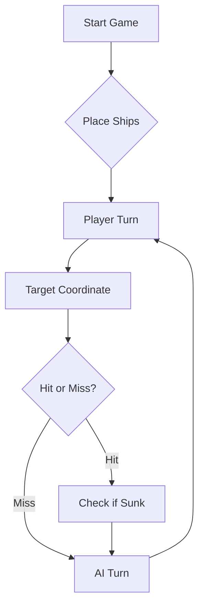

# ⚓ Battleship 2.0


> A modern take on the classic naval warfare game, designed for the XVII century setting with updated software engineering patterns.

---
## Grupo: TP06-5

### Curso
Informática e Gestão de Empresas

## Membros
| Número  | Nome              |
|---------|-------------------|
| 105498  | Luís Manteigas    |
| 112244  | Fábio Reis        |
| 122989  | Carolina Lisboa   |
| 123022  | Rita Peixoto      |

NOTA: O repositório foi criado pelo aluno com o número (112244) para que pudessemos dar seguimento ao trabalho em regime PL, uma vez que o regime de diurno não alcançou a parte B durante a sua aula.

## Respostas à Ficha 2:

**B.**

2. O Maven descobre as dependências transitivas através de um processo recursivo de leitura de ficheiros pom.xml das dependências diretas, ou seja, quando declaramos uma dependência direta no  pom.xml, o Maven vai ao repositório buscar não só o .jar dessa biblioteca, mas também o seu pom.xml. Esse ficheiro declara por sua vez as dependências daquela biblioteca (que para o nosso projeto são transitivas). O Maven repete este processo para cada nova dependência encontrada, até esgotar toda a árvore, gerindo automaticamente duplicados que possam surgir por caminhos diferentes.
   
As compilações seguintes são mais rápidas porque, na primeira compilação, o Maven descarrega todas as dependências (diretas e transitivas) do repositório central remoto para o repositório local, o que envolve transferências, naturalmente lentas. Nas compilações seguintes, o Maven verifica primeiro o repositório local e, como as dependências já lá estão, não precisa de as voltar a descarregar, acedendo diretamente às cópias locais, sendo o acesso ao disco substancialmente mais rápido do que as transferências.

A única exceção são dependências marcadas como SNAPSHOT, que o Maven verifica periodicamente no repositório remoto (por omissão, uma vez por dia) para garantir que a versão de desenvolvimento mais recente é sempre utilizada.


## 📖 Table of Contents
- [Project Overview](#-project-overview)
- [Key Features](#-key-features)
- [Technical Stack](#-technical-stack)
- [Installation & Setup](#-installation--setup)
- [Code Architecture](#-code-architecture)
- [Roadmap](#-roadmap)
- [Contributing](#-contributing)

---

## 🎯 Project Overview
This project serves as a template and reference for students learning **Object-Oriented Programming (OOP)** and **Software Quality**. It simulates a battleship environment where players must strategically place ships and sink the enemy fleet.

### 🎮 The Rules
The game is played on a grid (typically 10x10). The coordinate system is defined as:

$$(x, y) \in \{0, \dots, 9\} \times \{0, \dots, 9\}$$

Hits are calculated based on the intersection of the shot vector and the ship's bounding box.

---

## ✨ Key Features
| Feature | Description | Status |
| :--- | :--- | :---: |
| **Grid System** | Flexible $N \times N$ board generation. | ✅ |
| **Ship Varieties** | Galleons, Frigates, and Brigantines (XVII Century theme). | ✅ |
| **AI Opponent** | Heuristic-based targeting system. | 🚧 |
| **Network Play** | Socket-based multiplayer. | ❌ |

---

## 🛠 Technical Stack
* **Language:** Java 17
* **Build Tool:** Maven / Gradle
* **Testing:** JUnit 5
* **Logging:** Log4j2

---

## 🚀 Installation & Setup

### Prerequisites
* JDK 17 or higher
* Git

### Step-by-Step
1. **Clone the repository:**
   ```bash
   git clone [https://github.com/britoeabreu/Battleship2.git](https://github.com/britoeabreu/Battleship2.git)
   ```
2. **Navigate to directory:**
   ```bash
   cd Battleship2
   ```
3. **Compile and Run:**
   ```bash
   javac Main.java && java Main
   ```

---

## 📚 Documentation

You can access the generated Javadoc here:

👉 [Battleship2 API Documentation](https://britoeabreu.github.io/Battleship2/)


### Core Logic
```java
public class Ship {
    private String name;
    private int size;
    private boolean isSunk;

    // TODO: Implement damage logic
    public void hit() {
        // Implementation here
    }
}
```

### Design Patterns Used:
- **Strategy Pattern:** For different AI difficulty levels.
- **Observer Pattern:** To update the UI when a ship is hit.
</details>

### Logic Flow


---

## 🗺 Roadmap
- [x] Basic grid implementation
- [x] Ship placement validation
- [ ] Add sound effects (SFX)
- [ ] Implement "Fog of War" mechanic
- [ ] **Multiplayer Integration** (High Priority)

---

## 🧪 Testing
We use high-coverage unit testing to ensure game stability. Run tests using:
```bash
mvn test
```

> [!TIP]
> Use the `-Dtest=ClassName` flag to run specific test suites during development.

---

## 🤝 Contributing
Contributions are what make the open-source community such an amazing place to learn, inspire, and create.

1. Fork the Project
2. Create your Feature Branch (`git checkout -b feature/AmazingFeature`)
3. Commit your Changes (`git commit -m 'Add some AmazingFeature'`)
4. Push to the Branch (`git push origin feature/AmazingFeature`)
5. Open a **Pull Request**

---

## 📄 License
Distributed under the MIT License. See `LICENSE` for more information.

---
**Maintained by:** [@britoeabreu](https://github.com/britoeabreu)  
*Created for the Software Engineering students at ISCTE-IUL.*
